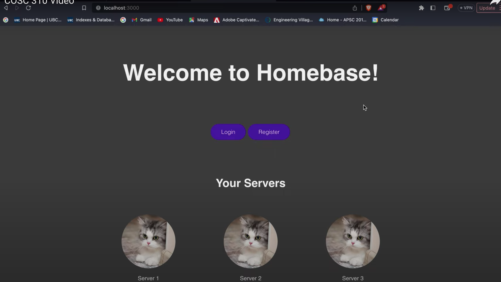
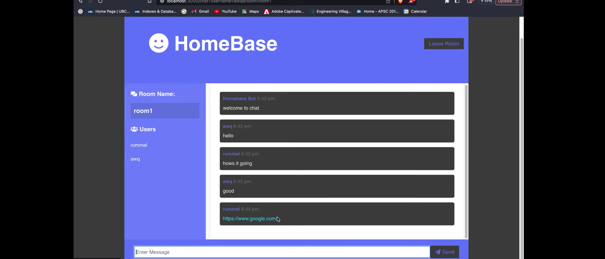

# Discord Clone Project - HomeBase Application

### Description

Homebase, is designed to be a minimalistic clone of Discord, the popular chat and voice communication service. Within our service, users will be able to make accounts, and edit their accounts to have a personalized name, profile picture, and bio. The user will also then be able to join a server off of a unique invite code being given to them, unique to an individual server. If the user does not wish to join another server, they also have the opportunity to make their own in which they will be owner and administrator on. Within servers, users will be able to view the sent messages within those text channels, and the member list of the server. If they are the owner, they can delete the server in its entirety also. Within a channel, a user can post a message which can include both plain text, and hyperlinks to other websites. While idlely browsing servers, a user will be able to see messages as they come in real time. When a user is done using the software, they will be able to log out, or potentially delete their account if they no longer want to use the service. A user can return by signing in again, and if they cannot remember their password that they used before, can request to have it reset.

This project allowed me to advance my understanding of software engineering principles, tools, and techniques using structured requirements gathering and analysis, software development process, design patterns, software architecture and software testing. As well as building my experience in development methodology, software metrics, and software quality assurance. 

This required formal analysis, development of an architecture, using Test Driven Design and an Agile workflow, to iterate and develop the project. 

The application was developed with a 3-tier system architecture (Client Side [HTML/CSS] / Server Side [Express.js] / Database [MongoDB])

#### Code can be found in the following
- [Views](views)
- [Routes](routes)
- [SchemaModels](models)
- [Tests](tests)

#### Documentation
- [ArchitectureDiagrams](docs/ArchitectureDiagram)
- [ClassDiagrams](docs/ClassDiagrams)
- [DataFlowDiagrams](docs/DataFlowDiagrams)
- [SequenceDiagrams](docs/SequenceDiagrams)

#### Snapshots of the application

